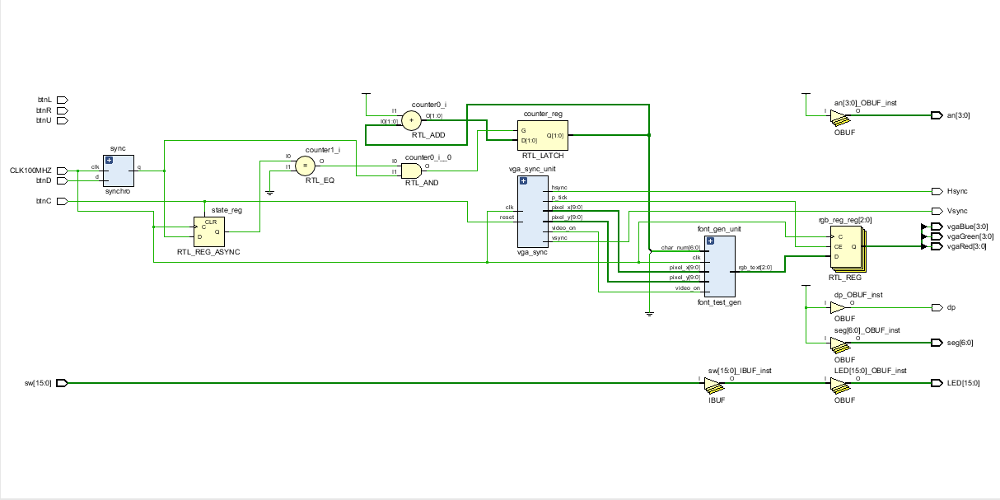

# Push Button. Get Image

A VHDL project that creates a Finite State Machine where each time we switch between states, we output a different image to the VGA monitor, and states are cycled through using a button on the Basys 3 board. Also, the current image that is being displayed also corresponds to an LED being lit up on the board. 

## How to use the hardware

The hardware we are using for this project is the Basys 3 board, for use with the Vivado design suite. The way that our project uses the hardware is with the down button, which is programmed to switch states. Whenever you press the down button, a different image will appear, cycling between 4 different images and the corresponding LED for each image will light up.
## Assumptions
There weren't really any assumptions that we had to make for this project, other than assuming that the user has a basys 3 board and knows how to push a button.

## Hardware diagram

## Works Cited
We used Kent's ic_25 and ic_27 as guidelines for this project. We got all of our information on how to program the VGA board and display characters to the screen from ic_27 and all of our information on the finite state machine from ic_25, as well as help from Kent himself. 

## Authors

* **Ben Greenwood** - *Group Member* 
* **Brycen Martin** - *Group Member* 
* **Niklas Roberts** - *Group Member* 

